# Plot.ly Homework - Belly Button Biodiversity

Build an interactive dashboard to explore the Belly Button Biodiversity dataset, which catalogs the microbes that colonize human navels.

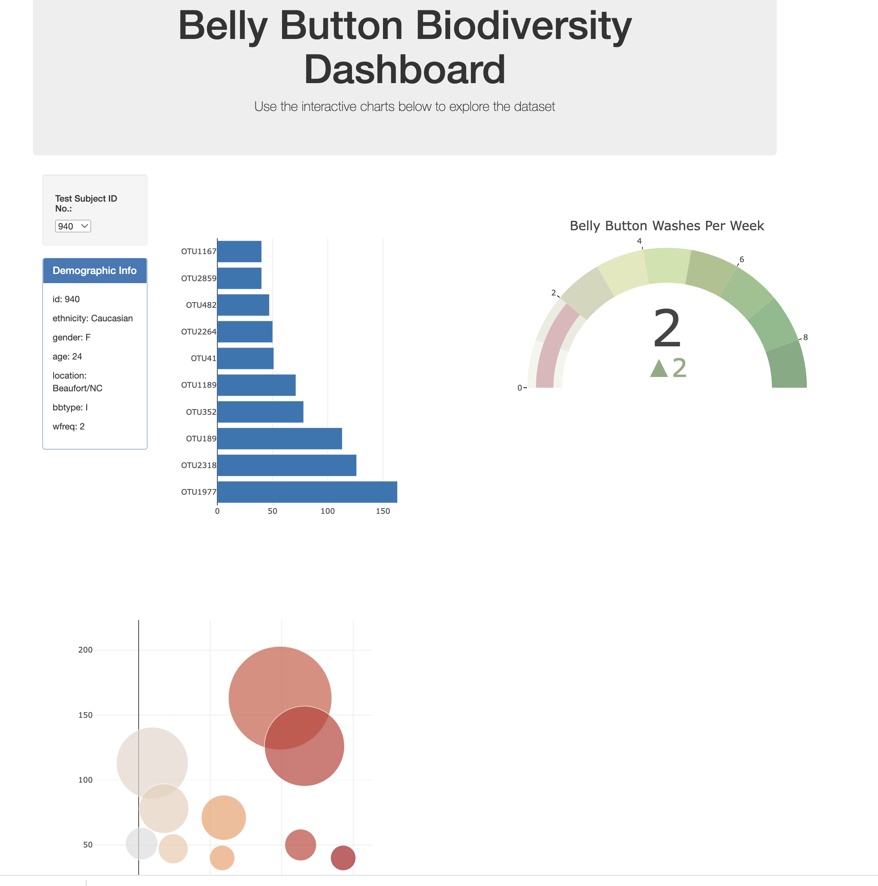

1. Use the D3 library to read in `samples.json`.

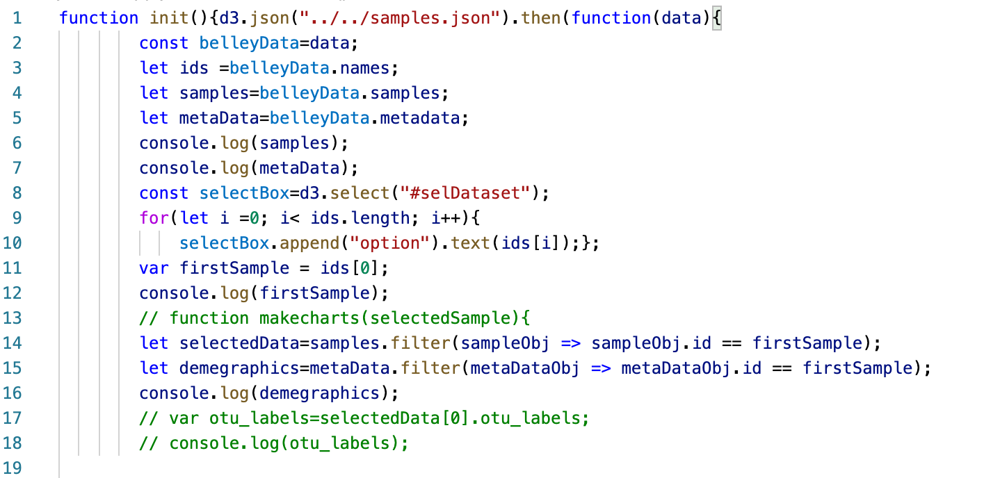

2. Create a horizontal bar chart with a dropdown menu to display the top 10 OTUs found in that individual.

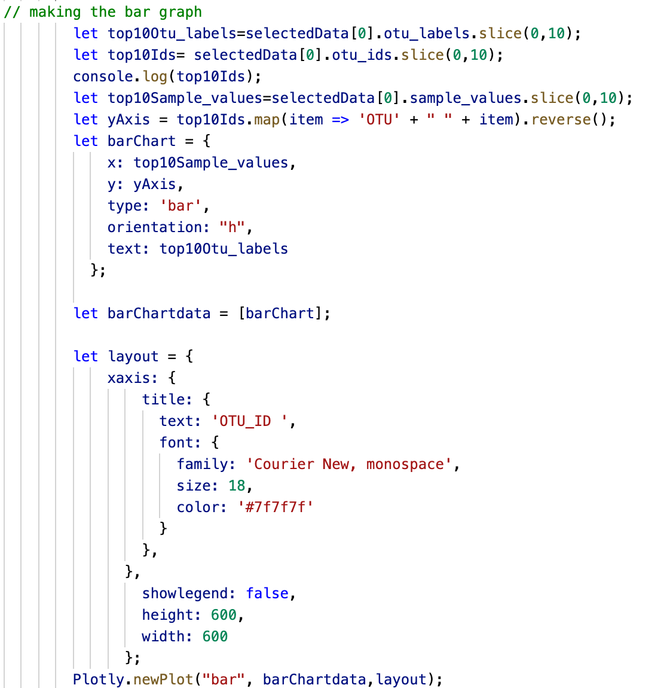

* Use `sample_values` as the values for the bar chart.

* Use `otu_ids` as the labels for the bar chart.

* Use `otu_labels` as the hovertext for the chart.

  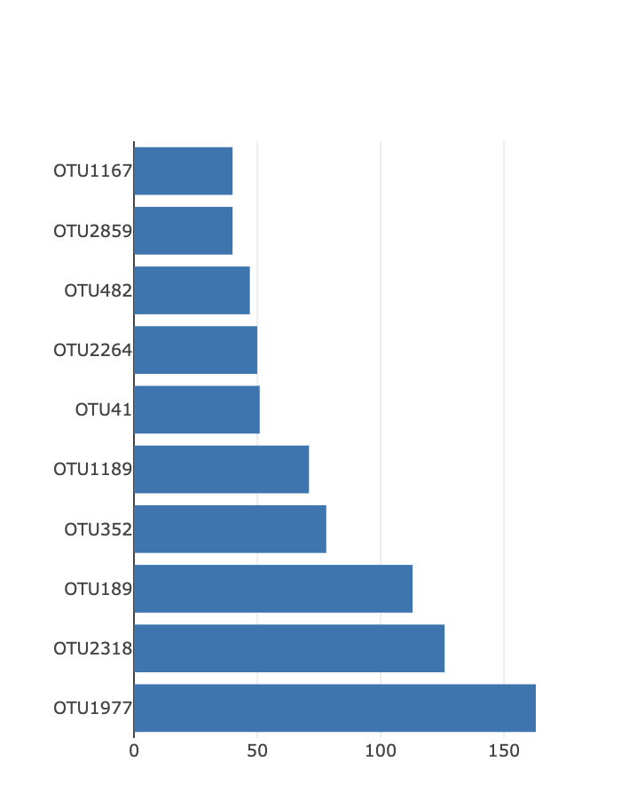

3. Create a bubble chart that displays each sample.

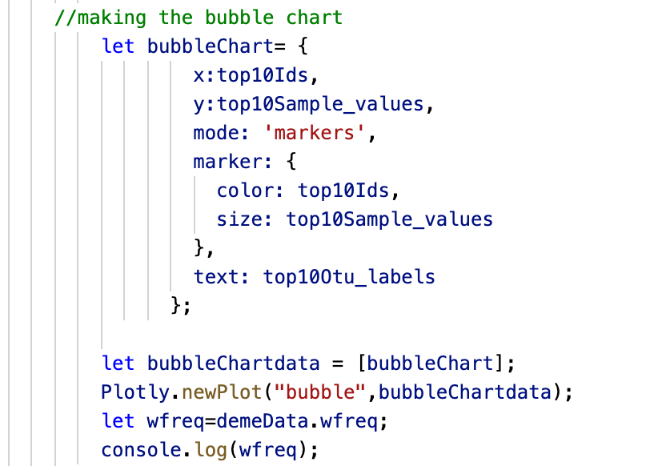

* Use `otu_ids` for the x values.

* Use `sample_values` for the y values.

* Use `sample_values` for the marker size.

* Use `otu_ids` for the marker colors.

* Use `otu_labels` for the text values.

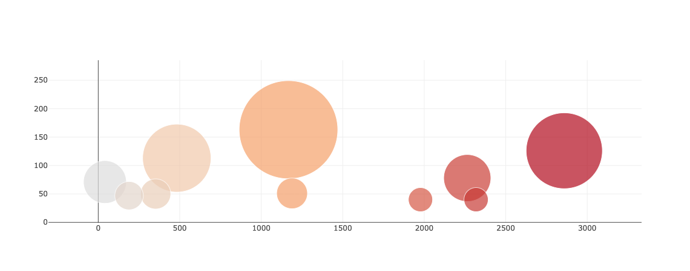

4. Display the sample metadata, i.e., an individual's demographic information.

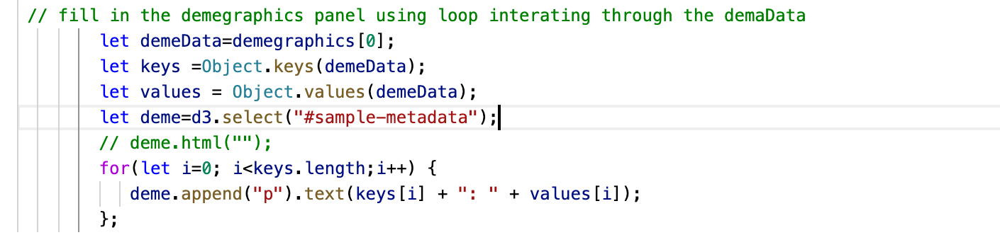

5. Display each key-value pair from the metadata JSON object.

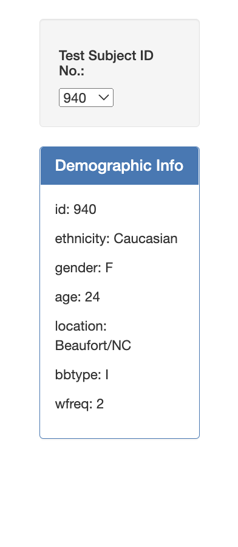

*Creat gauge code to account for values ranging from 0 through 9.
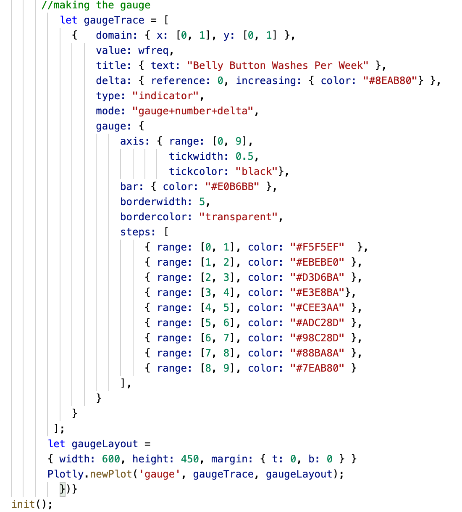

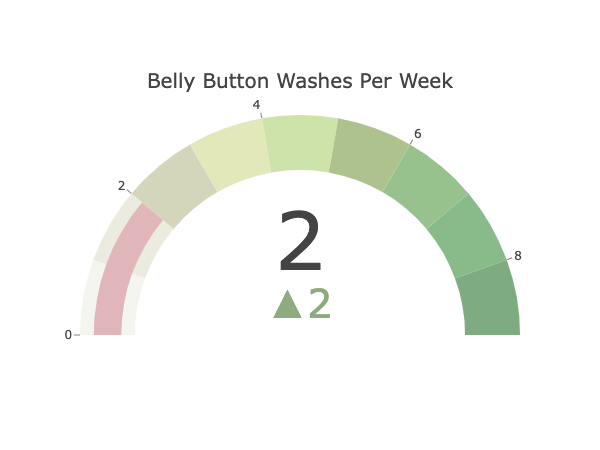

* Update the chart whenever a new sample is selected.

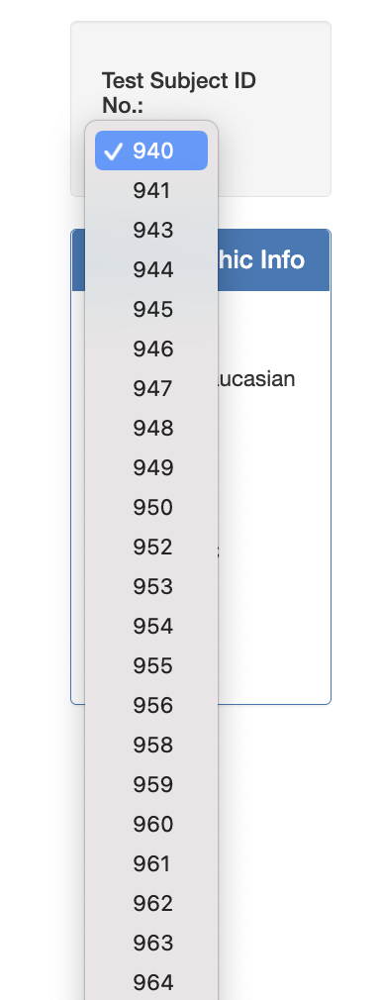

